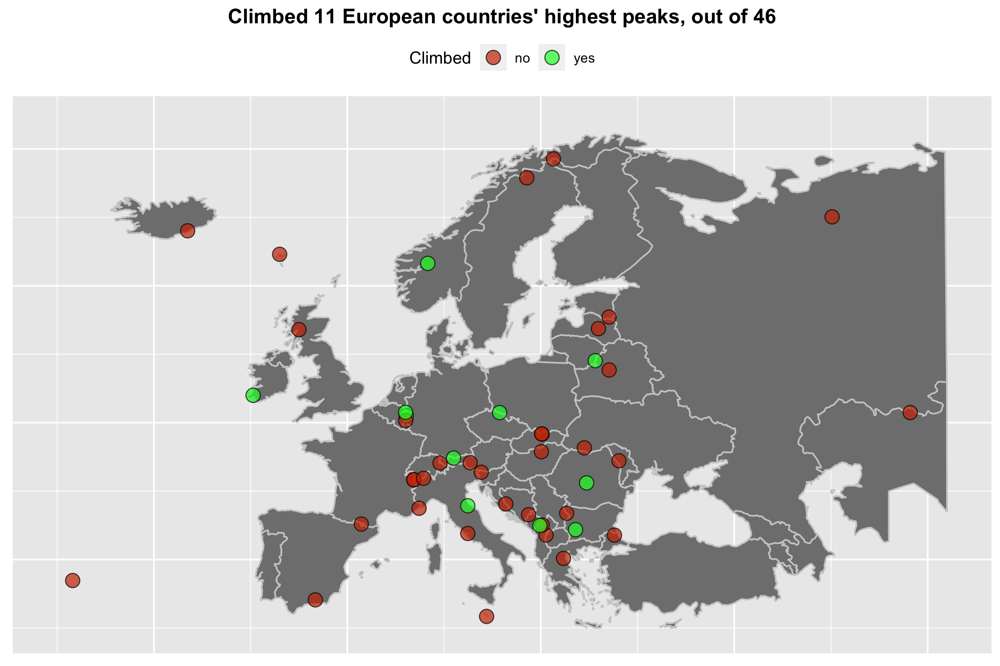

# Highest Peaks of European Countries

The goal of the project is to visit the highest natural elevation of each sovereign state on the continent of Europe. Most of them are mountains or hills, but some are simply elevations that are not distinguishable as geographical features.

### Assumptions behind the list

* Only peaks located in Europe, with its [borders as defined by the International Geographical Union](https://en.wikipedia.org/wiki/Boundaries_between_the_continents_of_Earth#Europe_and_Asia), are considered. This means that Mount Elbrus is located in Asia and is not part of the list.
* Peaks belonging to European countries, but located outside of Europe, are not considered. Examples include:
    * Pico del Teide - Spain, Canary Islands;
    * Gunnbjørn Fjeld - Denmark, Greenland;
    * Mount Scenery - The Netherlands, Carribean Netherlands.
* In the case of countries located partly in Europe (Turkey, Russia and Kazakhstan), the peak considered in the list is the highest peak of their European territory.
* The Italian-French border is assumed to run below the summit of Mont Blanc. Thus, Italy's highest peak is Mont Blanc de Courmayeur and Mont Blanc is located entirely in France.

### Climbing progress

| Rank|Country                |Peak                       |Elevation |Climbed             |
|----:|:----------------------|:--------------------------|:---------|:-------------------|
|    1|France                 |Mont Blanc                 |4,809 m   |                    |
|    2|Italy                  |Monte Bianco di Courmayeur |4,748 m   |                    |
|    3|Switzerland            |Dufourspitze               |4,634 m   |                    |
|    4|Austria                |Grossglockner              |3,798 m   |                    |
|    5|Spain                  |Mulhacen                   |3,479 m   | ✔️ |
|    6|Germany                |Zugspitze                  |2,962 m   | ✔️ |
|    7|Andorra                |Coma Pedrosa               |2,942 m   |                    |
|    8|Bulgaria               |Musala                     |2,925 m   | ✔️ |
|    9|Greece                 |Mytikas                    |2,919 m   |                    |
|   10|Slovenia               |Triglav                    |2,864 m   |                    |
|   11|Albania                |Korab                      |2,764 m   |                    |
|    -|North Macedonia        |Korab                      |2,764 m   |                    |
|   12|Kosovo                 |Djeravica                  |2,656 m   |                    |
|   13|Slovakia               |Gerlach                    |2,655 m   |                    |
|   14|Liechtenstein          |Grauspitz                  |2,599 m   | ✔️ |
|   15|Romania                |Moldoveanu                 |2,544 m   | ✔️ |
|   16|Montenegro             |Zla Kolata                 |2,534 m   | ✔️ |
|   17|Poland                 |Rysy                       |2,499 m   | ✔️ |
|   18|Norway                 |Galdhopiggen               |2,469 m   | ✔️ |
|   19|Bosnia and Herzegovina |Maglic                     |2,386 m   |                    |
|   20|Portugal               |Pico                       |2,351 m   |                    |
|   21|Serbia                 |Midzur                     |2,169 m   |                    |
|   22|Iceland                |Hvannadalshnukur           |2,110 m   |                    |
|   23|Sweden                 |Kebnekaise                 |2,104 m   |                    |
|   24|Ukraine                |Hoverla                    |2,061 m   |                    |
|   25|Russia                 |Mount Narodnaya            |1,895 m   |                    |
|   26|Croatia                |Vrh Dinare                 |1,831 m   |                    |
|   27|Czech Republic         |Snezka                     |1,603 m   | ✔️ |
|   28|United Kingdom         |Ben Nevis                  |1,344 m   |                    |
|   29|Finland                |Halti                      |1,324 m   |                    |
|   30|Ireland                |Carrantuohill              |1,041 m   | ✔️ |
|   31|Turkey                 |Mahya Dagi                 |1,031 m   |                    |
|   32|Hungary                |Kekes                      |1,014 m   |                    |
|   33|Denmark                |Slaettaratindur            |882 m     | ✔️ |
|   34|San Marino             |Monte Titano               |749 m     | ✔️ |
|   35|Belgium                |Signal de Botrange         |694 m     | ✔️ |
|   36|Luksemburg             |Kneiff                     |560 m     | ✔️ |
|   37|Kazakhstan             |Unnamed peak               |509 m     |                    |
|   38|Moldova                |Balanesti                  |430 m     |                    |
|   39|Belarus                |Dzyarzhynskaya Hara        |345 m     |                    |
|   40|The Netherlands        |Vaalsenberg                |321 m     | ✔️ |
|   41|Estonia                |Suur Munamagi              |318 m     |                    |
|   42|Latvia                 |Gaizinkalns                |312 m     | ✔️ |
|   43|Lithuania              |Aukstojas Hill             |294 m     | ✔️ |
|   44|Malta                  |Ta' Dmejrek                |253 m     |                    |
|   45|Monaco                 |Chemin des Revoires        |163 m     |                    |
|   46|Vatican                |Vatican Hill               |75 m      |                    |

 

