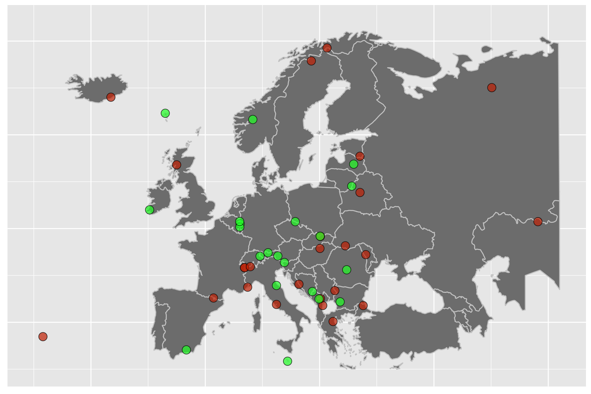

# Highest Peaks of European Countries

Assumptions behind the list:

* Only peaks located in Europe, with its borders as defined by the International Geographical Union, are considered. This means that Mount Elbrus is located in Asia and is not part of the list.
* Peaks belonging to European countries, but located outside of Europe, are not considered. Examples are:
    * Pico del Teide - Spain, Canary Islands;
    * Gunnbjørn Fjeld - Danmark, Greenland;
    * Mount Scenery - The Netherlands, Carribean Netherlands.
* In the case of countries located partly in Europe (Turkey, Russia, Kazakhstan), the peak considered in the list is the highest peak of their European area.
* The Italian-French border is assumed to run below the summit of Mont Blanc. Thus, Italy's highest peak is Mont Blanc de Courmayeur and Mont Blanc is located entirely in France.

# Visited Places

